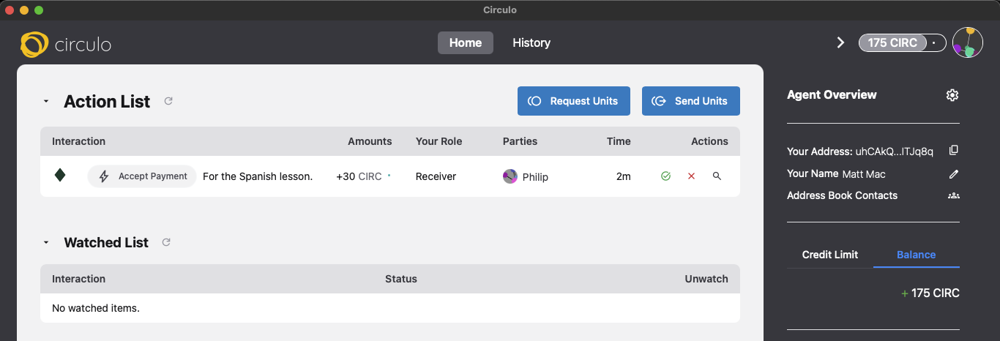
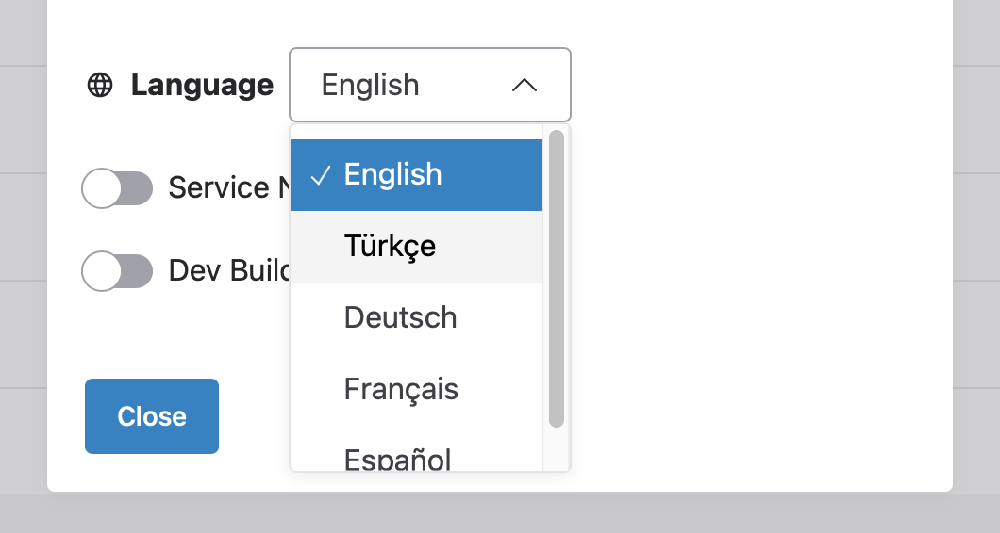

# 

&nbsp;

<table><tr>
<td><b>README dosyasını şu dilde görüntüle: </b></td>
<td><a href=./README.md>İngilizce</a><//td>
<td><a href=./README-tr.md> Türkçe </a><//td>
<td><a href=./README-de.md> Almanca </a><//td>
<td><a href=./README-fr.md> Fransızca </a><//td>
<td><a href=./README-es.md> İspanyolca </a><//td>
</tr></table>

## Eşler Arası Ödemelere Eğlenceli Bir Bakış

<h3>

</h3>
<h3>
Giriş
</h3>

Circulo'nun 3. sürümüne hoş geldiniz!

Circulo, Unyt karşılıklı kredi muhasebe motoru kullanılarak geliştirilmiş, cömertlik odaklı bir eşler arası ödeme sistemidir.

Herkes sıfır bakiye ve küçük bir kredi limitiyle başlar. Kredi limitiniz, sıfırın altında harcayabileceğiniz maksimum tutarı belirler.

Circulo çok basit bir kredi algoritması kullanır: Birine her birim gönderdiğinizde, kredi limitiniz biraz artar. Bu çok basit ve kolayca oynanabilen bir kredi algoritmasıdır. Ayrıca, insanların onunla oynamasını da kolaylaştırır.

Circulo'da, birine birim gönderdiğiniz anda hesabınızdan para çekilir. Ancak, alıcının hesap bakiyesi, kendi inisiyatifini kullanıp kabul edene kadar bu birimleri içermez. Hiçbir zaman kabul etmeseler bile, toplamaları için hazır kalırlar. Başka hiç kimse bunları talep edemez.

Circulo, etkinliği katılımcıların kendi inisiyatifine bağlayarak bazı ilginç yeni verimlilikler ve olanaklar sunar. Bunlar, gelecek sürümlerde daha ayrıntılı olarak incelenecektir.

Sadece bu sürüm hakkında değil, aynı zamanda Circulo'nun Unyt ve Holochain'i genel olarak iyileştirmede oynadığı rol hakkında daha fazla bilgi için <a href="https://unyt.co/blog/circulo3/">Circulo3 blog gönderisine</a> göz atın. 

<h3>
Test
</h3>

Circulo'nun bu üçüncü sürümü, Türkçe, Almanca, İspanyolca ve Fransızca dahil olmak üzere birden fazla dili destekliyor. Aracı Genel Bakış > Ayarlar > Dil bölümüne gidin ve size uygun ana dili seçin. Ayrıca, eklenmesini istediğiniz ve yardımcı olabileceğiniz başka bir dil varsa, bize ulaşın.

Circulo3 ayrıca, uygulamayı biraz daha hızlı ve güvenilir hale getirmesi gereken bazı performans iyileştirmeleri de içeriyor.

Hem sohbete hem de testlere katılmak istiyorsanız, info@unyt.co adresine "Oynamak istiyorum!" konulu bir e-posta göndererek Circulo Telegram kanalına katılma talebinde bulunun. Ekibimiz size bir davet bağlantısı gönderecektir.

Circulo'nun 3. sürümü için tek bir odaklı test turu yapmayı planlıyoruz.

Testler 5 Kasım Çarşamba günü başlayacak ve katılımcılardan işlem göndermelerini, farklı dilleri denemelerini ve genel olarak uygulamayı birkaç gün boyunca keşfetmelerini rica ediyoruz.

7 Kasım Cuma gününden sonra, kullanıcılar uygulamayı oynamaya devam edebilir, ancak çoğu kişinin (ekibimiz de dahil) testlerini tamamlamış olacağını ve uygulamayı artık kullanmayabileceğini varsayıyoruz. 

<a href="https://docs.google.com/spreadsheets/d/1W-Ljs5lc6d4CjCTFKTYIoSxJr6ShJt26LZFvzyuHnbQ/edit?usp=sharing">Circulo3 Adres Sayfasında</a> CIRC gönderebileceğiniz kişileri bulun.

Ve <a href="https://forms.gle/F87ZVcX9avZEL985A">bu formu kullanarak kendinizi ekleyin</a>, böylece başkaları da size CIRC gönderebilir.

Not: Lütfen Circulo3'ten bir adres paylaştığınızdan ve önceki bir Circulo sürümünden paylaşmadığınızdan emin olun. 

Bir hata görürseniz, lütfen bu depoda <a href="https://github.com/unytco/circulo-tx5/issues">sorun olarak bildirin</a> (henüz bildirilmediyse). Veya en azından Circulo Telegram Kanalında bahsedin ve #issue etiketiyle etiketleyin.

Bir hatayı aşmak için:

1. Bekleyin: Kendinize bir fincan çay yapmak çoğu sorunu çözer.
2. Yeniden Yükle: Şüpheye düştüğünüzde deneyin: Sağ tıklayın > Yeniden Yükle (ancak tekrar tekrar yeniden yüklemek, her yeniden yükleme sayfadaki her şeyi yeniden talep edeceğinden bekleme sürenizi uzatabilir.)
3. Yeniden Başlat: Birkaç yeniden yükleme denemesi işe yaramazsa, lütfen çıkıp yeniden başlatın.

Hataların sıklığını ve bağlamını daha iyi anlayabilmek için Sentry adlı bir yazılım kullanıyoruz. Ancak sorunları bildirmeniz de çok faydalı olacaktır. 

## İndirilenler

<table>
<tr>
<td width="33%" align="center">

#### **Windows**

---

<a href="https://github.com/unytco/circulo-tx5/releases/download/v0.3.0/Circulo_zero-arc_0.3.0_x64_windows.msi">MSI Yükleyici (x64)</a>

<a href="https://github.com/unytco/circulo-tx5/releases/download/v0.3.0/Circulo_zero-arc_0.3.0_x64_windows.exe">EXE Kurulumu (x64)</a>

</td>
<td width="25%" align="center">

#### **MacOS**

---

<a href="https://github.com/unytco/circulo-tx5/releases/download/v0.3.0/Circulo_zero-arc_0.3.0_aarch64_darwin.dmg">Apple Silicon (arm64)</a>

<a href="https://github.com/unytco/circulo-tx5/releases/download/v0.3.0/Circulo_zero-arc_0.3.0_x64_darwin.dmg">Intel (x64)</a>

</td>
<td width="25%" align="center">

#### **Linux**

---

<a href="https://github.com/unytco/circulo-tx5/releases/download/v0.3.0/Circulo_zero-arc_0.3.0_amd64_linux.AppImage">AppImage</a>

<a href="https://github.com/unytco/circulo-tx5/releases/download/v0.3.0/Circulo_zero-arc_0.3.0_amd64_linux.deb">Debian (.deb)</a>

</td>

---

</tr>
</table>

## Kurulum

<strong>Windows</strong>

1. `.msi` yükleyicisini indirin
2. Yükleyiciyi çalıştırın ve kurulum sihirbazını izleyin
3. Circulo'yu Başlat'tan başlatın menü

<strong>macOS</strong>

1. `.dmg` dosyasını indirin
2. DMG'yi açın ve Circulo'yu Uygulamalar klasörünüze sürükleyin
3. Uygulamalar'dan başlatın (uygulamaya Sistem Tercihleri ​​> Güvenlik bölümünden izin vermeniz gerekebilir)

<strong>Linux</strong>

**AppImage (Önerilen)**

1. `.AppImage` dosyasını indirin
2. Çalıştırılabilir hale getirin: `chmod +x circulo_0.1.0_amd64.AppImage`
3. Çalıştırın: `./circulo_0.1.0_amd64.AppImage`

**Debian/Ubuntu**

1. `.deb` paketini indirin
2. Kurun: `sudo dpkg -i circulo_0.1.0_amd64.deb`
3. `circulo` komutunu çalıştırın

<!-- 

<strong>Android</strong>

1. Cihazınızın mimarisine uygun APK dosyasını indirin
2. Cihaz ayarlarınızda "Bilinmeyen kaynaklardan yükle" seçeneğini etkinleştirin
3. APK dosyasını yükleyin
4. Uygulama çekmecenizden Circulo'yu başlatın

 -->

## Sistem Gereksinimleri

| Platform | Minimum Gereksinimler |
| ----------- | ------------------------------------------ |
| **Windows** | Windows 10 (64 bit) veya üzeri |
| **macOS** | macOS 10.15 (Catalina) veya üzeri |
| **Linux** | Ubuntu 18.04+ / eşdeğer dağıtım |

<!-- | **Android** | Android 7.0 (API seviyesi 24) veya üzeri | -->

**Önerilen:** 4 GB RAM, 1 GB boş disk alanı, güncellemeler için internet bağlantısı

## Destek

- <a href="https://github.com/unytco/circulo-tx5/issues">Sorun Bildir</a>

## Lisans

Bu proje, [LICENSE](LICENSE) dosyasında belirtilen koşullar altında lisanslanmıştır.